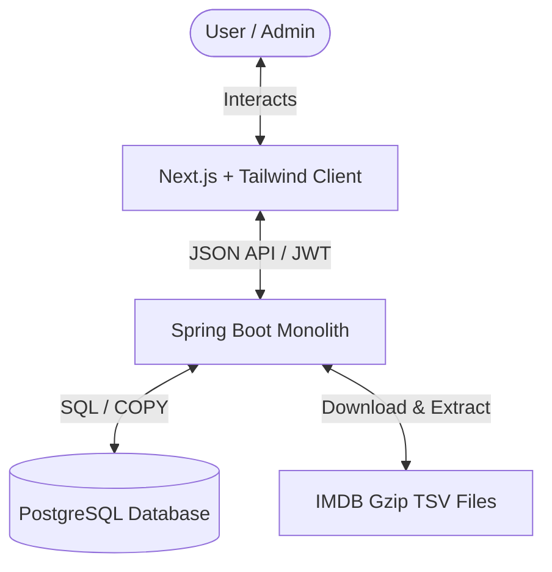

# User's intent

The user wants to create a Software Requirements Specification (SRS) for the **film-db** project. The SRS needs to be:
- **Minimal & Concise**: Avoiding corporate boilerplate, focusing on developer value.
- **Interesting**: Engaging to read, using modern formatting, visual tools, and clear structures.
- Follows a specific structure:
  - **Introduction** (Purpose, Scope)
  - **Overall Description** (Architecture, Tech Stack)
  - **System Features & Functional Requirements** (using `FR<name>` with fields: Description, Input, Output, Note)
  - **User & Use Cases**
  - **Non-functional Requirements**

The goal is to provide creative ideas on how to make it interesting, along with a complete, production-ready markdown template populated with actual details of the **film-db** project (using its real tech stack and backend APIs).

---

# Results

Here are our recommended ideas to make the SRS interesting and developer-friendly, followed by a complete template that you can copy, paste, and customize.

## 💡 Creative Ideas to Make the SRS Interesting

1. **Visualize with Mermaid Diagrams**: Replace text-heavy architectural summaries with dynamic Mermaid diagrams (e.g., flowcharts showing how the Next.js frontend, Spring Boot backend, and PostgreSQL database interact).
2. **Contextual Status Badges**: Use inline GitHub-style alerts and badges to mark stability, priority, or difficulty levels (e.g., `[!IMPORTANT]`, `[!TIP]`, `[Priority: High]`).
3. **Realistic Mock Inputs/Outputs**: Instead of abstract types, use clean, minimal JSON snippets or UI micro-states for inputs and outputs in the `FR<name>` definitions.
4. **Use Case Mapping**: Create a concise matrix mapping features directly to user personas, so it reads like a journey rather than a list of constraints.
5. **Interactive Navigation**: Include internal markdown anchor links to make jumping between requirements and architecture seamless.

---

## 📄 The Film-DB SRS Template & Draft

Below is the complete markdown document for your SRS. It has been customized specifically for **film-db** based on your tech stack (Next.js, React, Tailwind, Spring Boot, PostgreSQL) and actual backend API capabilities.

You can save this as `docs/SRS.md` in your project repository.

***

```markdown
# 🎬 Film-DB: Software Requirements Specification (SRS)

A modern, high-performance web interface for exploring IMDB movie datasets, curating personal lists, and managing import operations.

---

## 1. Introduction

### 1.1 Purpose
This document specifies the software requirements for the **Film-DB Frontend** application. It serves as the single source of truth for developers, designers, and testers to understand how the web interface interacts with the Film-DB modular monolith backend to deliver a seamless movie discovery and curation experience.

### 1.2 Scope
The Film-DB client is a responsive web application that provides:
* **Public Discovery**: Rich filtering and searching of movies, TV shows, and crew members sourced from the IMDB dataset.
* **Curation Engine**: Secure user authentication, profile customization, and custom list management (watchlist, favorites, custom-themed collections).
* **Administrative Console**: Tools for administrators to oversee users, review administrative access requests, and trigger data ingestion pipelines.

---

## 2. Overall Description

### 2.1 System Architecture
The application follows a client-server architecture. The frontend communicates with the Spring Boot backend via RESTful APIs, securing transactions using JWT access and refresh tokens.



### 2.2 Technology Stack
* **Client Frontend**:
  * **Framework**: Next.js (App Router, React 19)
  * **Styling**: Tailwind CSS (v4) for responsive utility-first layouts
  * **State Management & Fetching**: React Context, TanStack Query (React Query)
* **Backend Monolith** *(Reference)*:
  * Spring Boot 3.5 (Java), Gradle, PostgreSQL
  * JWT Auth & Session Cookie Management

---

## 3. System Features & Functional Requirements

> [!NOTE]
> All functional requirements utilize the prefix `FR-<domain>-<id>` for clean traceability.

### 3.1 Authentication & Profile (AUTH)

#### `FR-AUTH-01: User Registration`
* **Description**: Allows new visitors to create a standard user account.
* **Input**: `username`, `email`, `password`.
* **Output**: JWT access token in response body, HTTP-only refresh cookie, redirect to dashboard.
* **Note**: Passwords must be hashed on the backend using BCrypt.

#### `FR-AUTH-02: Admin Registration Request`
* **Description**: Allows special users to register with a pending admin status.
* **Input**: `username`, `email`, `password`, `admin_security_token` (optional).
* **Output**: Account created in `PENDING_APPROVAL` state.
* **Note**: Pending admins cannot access admin APIs until approved via `FR-ADM-02`.

#### `FR-AUTH-03: Profile Metadata Update`
* **Description**: Logged-in users can update their public profile info.
* **Input**: `displayName`, `bio` (max 500 chars).
* **Output**: Updated profile card, status `200 OK`.
* **Note**: Usernames can also be changed but must be verified for uniqueness first.

---

### 3.2 IMDB Search & Discovery (DISC)

#### `FR-DISC-01: Advanced Movie Filtering`
* **Description**: Search movies using multiple criteria (genre, rating range, year range, runtime).
* **Input**: Query parameters or JSON payload containing filter ranges + pagination fields (`page`, `size`).
* **Output**: Paginated list of movies with titles, ratings, release years, and poster placeholders.
* **Note**: Utilizes PostgreSQL indexes for sub-second queries on large datasets.

#### `FR-DISC-02: Cast & Crew Profiles`
* **Description**: Display a details page for actors, directors, and writers listing their filmography.
* **Input**: `personId` (string/UUID).
* **Output**: Person metadata, birth/death years, list of associated films.
* **Note**: Built to handle actors with hundreds of associated titles efficiently.

---

### 3.3 User Lists & Curation (LIST)

#### `FR-LIST-01: Create Personal List`
* **Description**: Users can create custom collections of movies.
* **Input**: `listName` (string), `description` (string), `isPublic` (boolean).
* **Output**: Newly created list object with a unique UUID.
* **Note**: Default system lists like "Favorites" and "Watchlist" are auto-created at signup.

#### `FR-LIST-02: Add Item to List`
* **Description**: Add a movie or show to an existing list with custom personal notes.
* **Input**: `listId` (UUID), `movieId` (string), `userNote` (string, optional).
* **Output**: Success confirmation, list total count increments.
* **Note**: Prevent duplicate entries of the same movie in a single list.

---

### 3.4 Administrative Console (ADM)

#### `FR-ADM-01: Import Trigger`
* **Description**: Trigger the importer module to download, clean, and load IMDB TSV files.
* **Input**: Administrative API trigger action (with confirmation modal).
* **Output**: Visual pipeline execution log (running status, row counts).
* **Note**: This is a blocking, high-resource backend action. A warning toast must be displayed before launch.

#### `FR-ADM-02: Approve Admin Role`
* **Description**: Approve pending admin requests.
* **Input**: Target `userId` (UUID).
* **Output**: User role updated to `ADMIN`, notification sent.
* **Note**: Only existing super-admins or authorized console roles can view or execute this.

---

## 4. User and Use Cases

### 4.1 User Personas
1. **Guest (Anonymous)**: Browses movies, looks up actors, reads ratings.
2. **Member (Authenticated)**: Enjoys the Guest features + curates lists, rates movies, and tracks watchlists.
3. **Administrator**: Oversees site health, manages users, and handles backend data ingestion pipelines.

### 4.2 Key Use Cases

```mermaid
usecaseDiagram
    actor Guest
    actor Member
    actor Admin

    Guest --> (Search Movies)
    Guest --> (View Actor Profile)
    
    Member --> (Search Movies)
    Member --> (Manage Custom Lists)
    Member --> (Rate & Review)
    
    Admin --> (Approve Pending Admins)
    Admin --> (Trigger IMDB Data Import)
    Admin --> (Ban/Deactivate Users)
```

---

## 5. Non-functional Requirements (NFR)

### 5.1 Performance & Latency
* **NFR-PERF-01**: Global search queries must return results in under **500ms** under normal network conditions.
* **NFR-PERF-02**: Heavy pages (like admin log dashboards) must use lazy loading or virtual scrolling for lists exceeding 100 entries.

### 5.2 Security
* **NFR-SEC-01**: Authentication tokens (JWT) must expire within **15 minutes**. Refresh tokens must be stored in secure, `HttpOnly`, `SameSite=Strict` cookies.
* **NFR-SEC-02**: Sensitive actions (e.g. account deletion, triggering imports) must require a CSRF token check.

### 5.3 UX & Accessibility
* **NFR-UX-01**: Fully responsive layout matching desktop, tablet, and mobile breakpoints.
* **NFR-UX-02**: Accessible color contrast meeting WCAG AA standards, support for screen readers, and full keyboard-navigable dialogs.
```
