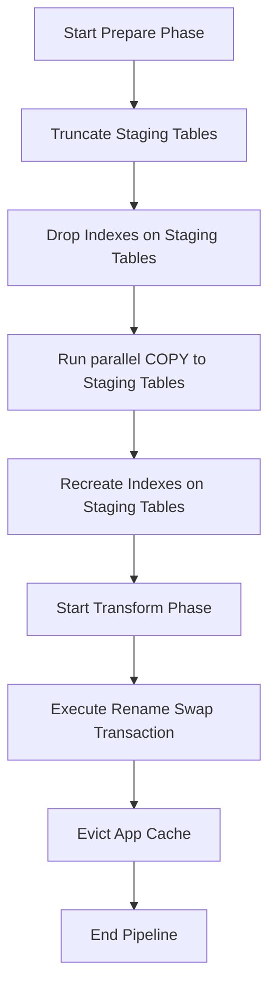

# User's Intent

The user refined their pipeline concept into two distinct phases:
1. **Prepare Phase:** Download data and import it into staging tables (users can query the application normally during this phase).
2. **Transform Phase:** Rename staging tables to active tables (swap).

The user is asking:
1. **App Availability:** How can the application temporarily "close" or block operations during the **Transform** phase, and resume working after a successful swap?
2. **Index Strategy:** How should database indexes be managed? In the transform phase, should we drop indexes, rename, and recreate them?

The plan must be updated in `.agent/output/plans/pipeline-importer-plan.md` with these refined details.

---

# Results

## 1. App Availability during the Transform Phase

Because the **Prepare** phase writes only to staging tables, users can continue using the application with no performance impact. For the **Transform** phase, we evaluate two ways to manage application availability:

### Option 1: Zero-Downtime MVCC Catalog Swap (Recommended)
PostgreSQL supports transactional DDL. Renaming tables in a single transaction takes exclusive catalog locks (`ACCESS EXCLUSIVE`) but does not touch physical data blocks. 
* **How it works:**
  1. The application stays fully online.
  2. The database executes the rename swap transaction.
  3. Any query running *during* that fraction of a millisecond will temporarily wait (block) and execute immediately once the transaction commits.
  4. Once the transaction commits, the application must **evict/clear its local caches** (e.g. Hibernate L2 cache, Spring `@Cacheable`, Redis search index buffers) to avoid serving stale data.
* **Pros:** Complete transparency; users do not see "maintenance" pages.
* **Cons:** Requires a cache eviction hook to prevent stale data reading.

### Option 2: Active Maintenance Mode / Read-Only Lock
Introduce an application-level state flag (e.g., `isTransforming` flag stored in a DB config or Redis) that is checked by a Spring Request Interceptor / Servlet Filter.
* **How it works:**
  1. At the start of the **Transform** phase, set `isTransforming = true`.
  2. The Filter blocks incoming HTTP read/write requests, returning `503 Service Unavailable` or a friendly holding screen (or queues write requests).
  3. Execute the table swap.
  4. Clear application caches.
  5. Reset `isTransforming = false` to resume traffic.
* **Pros:** Prevents any query contention during the swap and ensures strict consistency.
* **Cons:** Introduces unnecessary downtime if the swap only takes 10ms.

### Recommendation
Use **Option 1 (Zero-Downtime MVCC Catalog Swap)** combined with an automatic cache eviction event post-swap. An application-level lock (Option 2) is only necessary if the transform phase is slow or if we need to rebuild external search indexes (like Elasticsearch/Solr/custom Weighted Engine) that cannot be swapped atomically.

---

## 2. Database Index Strategy in the Pipeline

Creating indexes on tables containing millions of rows is slow, but inserting data into tables with existing indexes is even slower. We must avoid creating or dropping indexes during the **Transform** phase, as it would cause minutes of database lockups and downtime.

### Recommended Staging Index Strategy
All index drop-and-rebuild tasks must happen during the **Prepare** phase on the **staging** tables. The **Transform** phase remains a metadata-only swap of tables and their attached indexes.

* **Detailed Steps:**
  1. **Drop Staging Indexes:** At the start of the **Prepare** phase (after truncation), drop all indexes (except primary keys) on the `*_staging` tables.
  2. **Bulk Data Load:** Stream datasets into the staging tables using Postgres `COPY`. This will run at maximum speed since there are no indexes to update per row.
  3. **Rebuild Staging Indexes:** Once the copy completes, run `CREATE INDEX ...` on the staging tables. PostgreSQL will build the indexes using a highly optimized external merge sort.
  4. **Swap (Transform):** Run the atomic rename transaction. When the staging table (e.g., `movie_staging`) is renamed to the main table (e.g., `movie`), the index (e.g., `idx_movie_staging_title`) is automatically renamed/moved to the active table.
  5. **Prepare for next run:** In the next run, the staging table (which was the old active table) will contain the old index. We drop it, run COPY, recreate it, and swap.

* **Pros:**
  * **Zero-Downtime Swap:** Because the indexes are already fully built on the staging tables *before* the swap, the transform phase still takes milliseconds.
  * **Max Ingestion Speed:** Running `COPY` on index-free tables cuts import times by 3x–5x.

---

## 3. Updated Review of the Pipeline

| Pipeline Phase | Step | Current Behavior | Recommended Behavior |
| :--- | :--- | :--- | :--- |
| **Prepare** | **1. Wiping** | Truncates main tables (unsafe) | Truncate only `*_staging` tables. |
| **Prepare** | **2. Index Drop** | No indexes dropped | Drop secondary indexes on `*_staging` tables. |
| **Prepare** | **3. Ingestion** | Streams into main tables via JDBC `COPY` | Streams into `*_staging` tables via JDBC `COPY`. |
| **Prepare** | **4. Index Build** | N/A | Rebuild secondary indexes on `*_staging` tables. |
| **Transform** | **5. Table Swap** | N/A | Execute rename swap transaction (Zero-Downtime). |
| **Transform** | **6. Cache Evict** | N/A | Evict Spring/Hibernate/Redis caches. |

---

## 4. Refined Implementation Roadmap

### Task 1: Create Staging Tables and Migration
* Write a new Flyway migration `V4__create_imdb_staging_tables.sql` defining `*_staging` tables identical to `V1`.
* Include the staging indexes in this migration so the initial database schema is complete.

### Task 2: Implement Index Utility in Importer Service
* Write SQL helper functions in `ImdbImportService.java` to:
  * Drop secondary indexes on staging tables before COPY.
  * Recreate secondary indexes on staging tables after COPY.
  * *Tip:* Keep Primary Keys intact. Dropping and recreating Primary Keys is expensive and unnecessary; PostgreSQL optimizes COPY inserts for PKs well enough, and we need them to prevent duplicates.

### Task 3: Implement Atomic Rename & Cache Eviction Transaction
* Create a repository/service method to execute the rename swap SQL.
* Add a cache eviction service (e.g., using Spring `CacheManager` to call `.clear()`) to clear cached movies and search results.

### Task 4: Refactor Import Controller & Pipeline Orchestration
* Convert `/api/admin/import-pipeline` to run asynchronously.
* Integrate `ImportJobHistory` to log status:
  * `PREPARE_RUNNING` -> `PREPARE_SUCCESS` / `PREPARE_FAILED`
  * `TRANSFORM_RUNNING` -> `SUCCESSFUL` / `TRANSFORM_FAILED`
