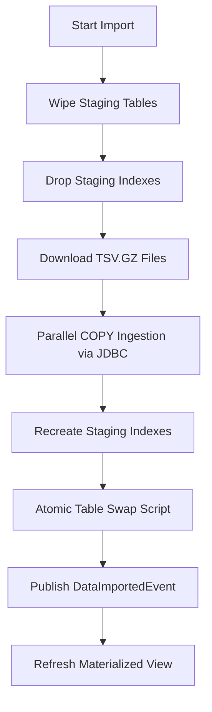
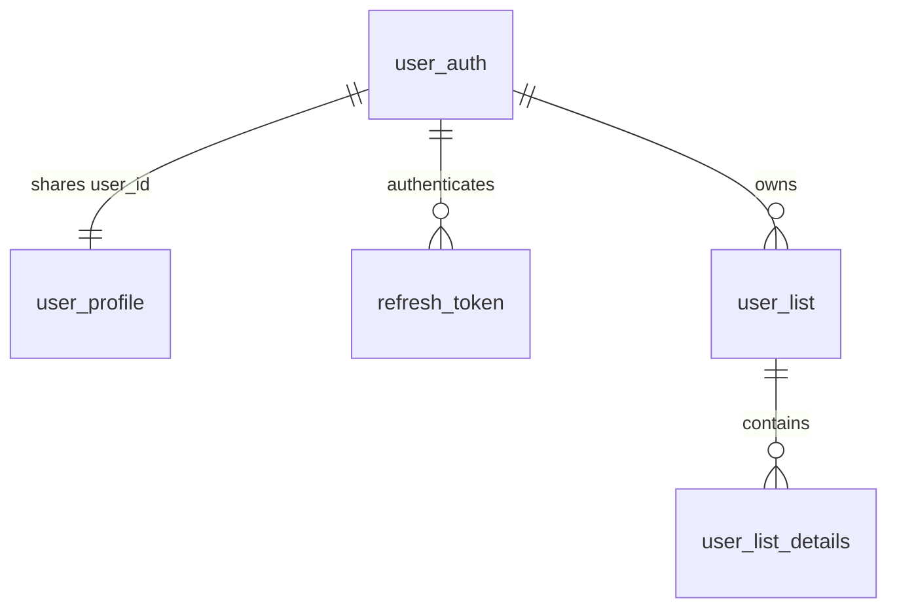

# Film DB Project Summary & Architecture Report

This report provides a comprehensive summary of the **Film DB** project, covering its architecture, technology stack, frontend, backend, internal mechanisms, and database schemas.

---

## 1. Executive Summary

**Film DB** is a high-performance web application built around the massive IMDb movies dataset. It is structured to deliver a rich, responsive interface powered by a secure, modular monolithic backend. The application features user authentication, personal movie lists, a robust and fast parallel data importer, admin oversight dashboards, and an advanced search engine utilizing PostgreSQL Full-Text Search (FTS) and Trigram matching with custom relevancy scoring.

---

## 2. Technology Stack

### Frontend Stack (Next.js Application)
- **Framework**: `Next.js 16.2.6` (React 19) utilizing the App Router with a component-driven architecture.
- **Language**: `TypeScript 5+` for compile-time safety and domain type definitions.
- **Styling**: `Tailwind CSS v4` providing a modern styling system, configured with PostCSS.
- **Client-side State**: `Zustand 5.0.13` managing global UI/authentication states client-side.
- **Server-side/API State**: `TanStack React Query 5.100.10` managing server data fetching, synchronization, cache policies, and pagination states.
- **API Client**: `Axios 1.16.0` configured with interceptors for header injection.
- **Form Management**: `React Hook Form 7.75.0` paired with `Zod 4.4.3` via `@hookform/resolvers` for robust client-side validation.
- **Notification Utility**: `React Hot Toast 2.6.0` for interactive user feedback alerts.
- **Icons**: `Lucide React 1.14.0`.

### Backend Stack (Spring Boot Monolithic Engine)
- **Framework**: `Spring Boot 3.5.13` organized as a modular monolith.
- **Language**: `Java 21` taking advantage of modern runtime features.
- **Build Tool**: `Gradle (Kotlin DSL)` for build configuration and dependencies.
- **Security**: `Spring Security 6` integrating stateless JWT authentication with cookie-based refresh tokens.
- **JSON Web Tokens (JWT)**: `JJWT (io.jsonwebtoken) 0.13.0` for signing and validating session tokens.
- **Database Access**: Hybrid approach utilizing:
  - **Spring Data JPA** for standard object-relational mapping (ORM) and simple CRUD operations.
  - **JDBC (`NamedParameterJdbcTemplate`)** for highly-optimized, low-overhead search queries.
- **Schema Migrations**: `Flyway 12.3.0` supporting SQL migration versioning and automated startup checks.
- **API Documentation**: `Springdoc OpenAPI (webmvc-ui) 2.8.17` generating interactive Swagger endpoints.
- **Boilerplate Reduction**: `Lombok 1.18.44`.

### Database Stack
- **Database Engine**: `PostgreSQL` (using the `postgresql` JDBC driver version `42.7.10`).
- **Extensions**: `pg_trgm` enabled to perform fuzzy string and trigram similarity searches.
- **Search Optimization**: Materialized Views coupled with `GIN` (Generalized Inverted Index) indexes to support rapid natural language queries.

---

## 3. Monolithic Core Modules

The backend codebase utilizes a **Modular Monolith** architecture where each core domain is isolated into its own project module:

```
film-db (Root Project)
├── apps/
│   └── backend                  # Orchestrates Spring Boot startup, config, and dependencies
├── modules/
│   ├── shared                   # Configs (JWT/CORS), Exception Handling, Security filters
│   ├── users                    # Registration, Login, Token Refresh, Profiles, Custom lists
│   ├── imdb                     # Movies, TvSeries, Cast Members metadata & domain queries
│   ├── search                   # Materialized view matching, FTS, Vietnamese localized search
│   ├── importer                 # Multithreaded bulk COPY TSV dataset pipelines
│   └── admin                    # Audit logging, role approval queues, admin job tracking
```

### Module Breakdown:
1. **`shared`**: Houses the global security infrastructure. Contains the `SecurityConfig`, the Custom `AuthenticationFilterWithJwt` (which intercepts requests to validate token authenticity), the `JwtService`, global exceptions (`AppException`), and cross-module Event classes like `ImdbDataImportedEvent` and `ImportProgressEvent`.
2. **`users`**: Dedicated to user identity and customization. It manages authentication controllers, user profiles (biographies, display names, avatars), and custom/system-generated lists (Watchlist, custom MIXTURE lists).
3. **`imdb`**: Serves metadata query endpoints for films (type, year, duration, runtime, cast, episodes) and cast profiles (personal known-for films, profession array).
4. **`search`**: Focuses entirely on searching movies and series. Queries a custom materialized view and contains logic for smart autocomplete (live suggestions) and localized searches (such as searches specific to Vietnamese titles).
5. **`importer`**: Ingestion subsystem. Handles the preparation (wiping and dropping indexes), downloading of IMDB TSV files, parallel stream parsing using the PostgreSQL `COPY` command, index recreation, and atomic table swaps.
6. **`admin`**: Handles admin workflows. Includes tools to review pending admin promotion requests, ban/activate user states, view data import histories, and log admin actions inside an audit trail (`admin.audit_log`).

---

## 4. Key Internal Mechanisms

### 4.1. JWT and Cookie-based Token Refresh Auth
Authentication is split to optimize security and stateless scaling:
1. **Access Token (JWT)**: Short-lived token, sent in the authorization header as `Bearer <token>`. Utilized by client APIs for immediate authentication.
2. **Refresh Token**: Long-lived, stored in a secure, `HTTP-only`, `SameSite=Strict` cookie (`refresh_jwt`).
3. **Flow**: During request routing, `AuthenticationFilterWithJwt` extracts and validates the Bearer token. Upon expiration, the frontend targets `/api/auth/refresh`. The backend validates the refresh cookie against the `users.refresh_token` table, verifies its timestamp, and issues a fresh Access/Refresh token pair.

### 4.2. High-Performance Bulk Parallel Import Pipeline
Importing millions of rows from IMDB raw dataset is resource-intensive. The importer solves this through a multi-staged transactional pipeline:



- **Index Dropping**: Dropping staging indexes prior to copying avoids the performance penalty of updating index trees on every insert.
- **Parallel stream ingestion**: Java's `CompletableFuture` spawns 7 parallel thread executors. Each executor unwraps the Spring JDBC data connection to a PostgreSQL `BaseConnection`, accesses the `CopyManager`, and streams raw gzip TSV data directly into PostgreSQL using `COPY imdb.<table_staging> FROM STDIN` via JDBC.
- **Array formatting**: A custom converter (`PostgreArrayFormatter`) translates raw columns (comma-separated professions or genres) into PostgreSQL text array format (`{value1,value2}`) on-the-fly.
- **Atomic Table Swap**: A transactional SQL script runs `ALTER TABLE imdb.movie RENAME TO movie_old; ALTER TABLE imdb.movie_staging RENAME TO movie;` etc., ensuring zero downtime for the query layer. The old tables are swapped to become the new staging tables.

### 4.3. Asynchronous Search Index Refresh via Event Decoupling
To decouple the `importer` module from the `search` module, the database swap triggers a Spring Application Event:
1. Once table renaming finishes, the importer fires an `ImdbDataImportedEvent(jobId)`.
2. The `search` module's `SearchRefreshListener` listens for this event. 
3. When caught, it triggers `SearchRefreshService.refreshSearch()` asynchronously after transaction commit.
4. The service inspects the database to check if `search.movie_search` is populated. If it is, it refreshes the materialized view concurrently (`REFRESH MATERIALIZED VIEW CONCURRENTLY search.movie_search`) without locking the table. If it's the first import, it runs a full refresh.

### 4.4. Hybrid Smart Search Relevancy Formula
The smart search merges Full-Text Search (FTS) with trigram text similarity (`pg_trgm`) and logarithmic popularity scaling. The ranking score is calculated as:

$$\text{Relevance Score} = \left( 0.2 \times \text{FTS Rank (English)} + 0.4 \times \text{FTS Rank (Simple)} + 0.4 \times \text{Trigram Similarity} + \text{Prefix Match Bonus} + \text{Substring Position Bonus} \right) \times \text{Popularity Boost}$$

- **FTS Vectors**: Combines `primary_title` (Weight 'A') and `original_title` (Weight 'B') using both English stemmer configurations and Simple configurations.
- **Similarity**: Leverages trigram operator `%` to match typos and incomplete queries.
- **Prefix Match**: Gives a major boost (up to 1.0) if the title starts with the exact query string.
- **Substring Position**: Adds a position-based penalty bonus (e.g., $1.0 / \text{position}$) to favor matches appearing closer to the beginning of the title.
- **Popularity Boost**: Evaluates the logarithmic volume of votes `num_votes` and scale of the rating `average_rating` to prevent obscure matches with identical wording from outranking popular mainstream titles.

---

## 5. Database Schema Summary

The database uses four PostgreSQL schemas: `imdb` (active catalog data), `users` (user data), `admin` (admin metadata), and `search` (search index view). Staging tables in the `imdb` schema have identical fields and indexes to their active counterparts.

### 5.1. IMDB Schema (`imdb`)

Contains core media data imported from the IMDB dataset.

| Table Name | Column Name | Data Type | Key / Constraint | Description |
| :--- | :--- | :--- | :--- | :--- |
| **`person`**<br>`person_staging` | `person_id`<br>`primary_name`<br>`birth_year`<br>`death_year`<br>`primary_profession`<br>`known_for_titles` | VARCHAR(15)<br>TEXT<br>INTEGER<br>INTEGER<br>TEXT[]<br>TEXT[] | **PRIMARY KEY** | Unique cast/crew ID (e.g. nm0000102).<br>Full name.<br>Birth year.<br>Death year (nullable).<br>Array of professions.<br>Array of famous movie IDs. |
| **`movie`**<br>`movie_staging` | `movie_id`<br>`title_type`<br>`primary_title`<br>`original_title`<br>`is_adult`<br>`start_year`<br>`end_year`<br>`runtime_minutes`<br>`genres` | VARCHAR(15)<br>VARCHAR(50)<br>TEXT<br>TEXT<br>BOOLEAN<br>INTEGER<br>INTEGER<br>INTEGER<br>TEXT[] | **PRIMARY KEY** | Unique movie/show ID (e.g. tt0111161).<br>Category (movie, short, tvSeries).<br>Primary public title.<br>Original title.<br>Adult film flag.<br>Release year.<br>End year (for TV series).<br>Runtime length in minutes.<br>Array of genre tags. |
| **`movie_alternative`**<br>`movie_alternative_staging` | `movie_id`<br>`ordering`<br>`title`<br>`region`<br>`language`<br>`types`<br>`attributes`<br>`is_original_title` | VARCHAR(15)<br>INTEGER<br>TEXT<br>VARCHAR(10)<br>VARCHAR(20)<br>TEXT[]<br>TEXT[]<br>BOOLEAN | **PRIMARY KEY** (movie_id, ordering) | Associated media ID.<br>Display rank order.<br>Alternative localized title.<br>Region code (e.g. VN, US).<br>Language code.<br>Release type (alternative, dvd).<br>Extra attributes.<br>Is original title flag. |
| **`movie_crew`**<br>`movie_crew_staging` | `movie_id`<br>`directors`<br>`writers` | VARCHAR(15)<br>TEXT[]<br>TEXT[] | **PRIMARY KEY** | Associated media ID.<br>Array of director person IDs.<br>Array of writer person IDs. |
| **`movie_episode`**<br>`movie_episode_staging` | `movie_id`<br>`parent_movie_id`<br>`season_number`<br>`episode_number` | VARCHAR(15)<br>VARCHAR(15)<br>INTEGER<br>INTEGER | **PRIMARY KEY** | Episode media ID.<br>Parent show media ID.<br>Season number.<br>Episode sequence number. |
| **`movie_principal`**<br>`movie_principal_staging` | `movie_id`<br>`ordering`<br>`person_id`<br>`category`<br>`job`<br>`characters` | VARCHAR(15)<br>INTEGER<br>VARCHAR(15)<br>VARCHAR(100)<br>TEXT<br>TEXT | **PRIMARY KEY** (movie_id, ordering) | Associated media ID.<br>Display order rank.<br>Associated cast/crew person ID.<br>Category (actor, producer).<br>Specific job description.<br>Character names played (JSON-like string). |
| **`movie_rating`**<br>`movie_rating_staging` | `movie_id`<br>`average_rating`<br>`num_votes` | VARCHAR(15)<br>NUMERIC(3,1)<br>INTEGER | **PRIMARY KEY** | Associated media ID.<br>Average score out of 10.0.<br>Total number of score votes. |

#### IMDB Indexes:
- `idx_movie_type_year` on `imdb.movie (title_type, start_year)`
- `idx_movie_genres_gin` (GIN Index) on `imdb.movie (genres)`
- `idx_rating_votes_avg` on `imdb.movie_rating (num_votes DESC, average_rating DESC)`
- `idx_rating_avg_votes` on `imdb.movie_rating (average_rating DESC, num_votes DESC)`
- `idx_movie_episode_parent_season_number` on `imdb.movie_episode (parent_movie_id, season_number, episode_number ASC)`

---

### 5.2. Users Schema (`users`)

Manages user data, custom lists, and authentication configurations.



| Table Name | Column Name | Data Type | Key / Constraint | Description |
| :--- | :--- | :--- | :--- | :--- |
| **`user_auth`** | `user_id`<br>`username`<br>`password_hash`<br>`role`<br>`user_state` | UUID<br>VARCHAR(50)<br>TEXT<br>VARCHAR(20)<br>VARCHAR(20) | **PRIMARY KEY**<br>UNIQUE<br><br><br>DEFAULT 'ACTIVE' | Unique user account ID.<br>User login name.<br>Salted password hash.<br>Access level (USER, ADMIN).<br>Account status (ACTIVE, BANNED). |
| **`refresh_token`** | `id`<br>`user_id`<br>`token`<br>`expiry_date` | UUID<br>UUID<br>TEXT<br>TIMESTAMP WITH TZ | **PRIMARY KEY**<br>FOREIGN KEY (user_id)<br>UNIQUE<br> | Unique token record ID.<br>References `user_auth.user_id` (CASCADE).<br>Hashed refresh token payload.<br>Expirations timestamp limit. |
| **`user_profile`** | `user_id`<br>`username`<br>`bio`<br>`display_name`<br>`avatar_url`<br>`date_created` | UUID<br>VARCHAR(50)<br>TEXT<br>VARCHAR(100)<br>TEXT<br>TIMESTAMP WITH TZ | **PRIMARY KEY**<br>FOREIGN KEY (user_id)<br>UNIQUE<br><br><br>DEFAULT NOW() | Shared account ID (References `user_auth.user_id`).<br>Display username matching auth.<br>Profile bio text snippet.<br>Public profile display name.<br>Profile avatar image location link.<br>Creation date. |
| **`user_list`** | `list_id`<br>`user_id`<br>`name_list`<br>`list_type`<br>`is_custom`<br>`is_public`<br>`date_created` | UUID<br>UUID<br>VARCHAR(100)<br>VARCHAR(20)<br>BOOLEAN<br>BOOLEAN<br>TIMESTAMP WITH TZ | **PRIMARY KEY**<br>FOREIGN KEY (user_id)<br><br>DEFAULT 'MIXTURE'<br>DEFAULT true<br>DEFAULT false<br>DEFAULT NOW() | Unique user list ID.<br>References `user_auth.user_id` (CASCADE).<br>Custom name of the collection.<br>List type (MIXTURE, WATCHLIST).<br>User-created flag (vs auto system-created).<br>Shared access permission flag.<br>List creation date.<br>*Constraint*: **UNIQUE** `(user_id, name_list, list_type)` |
| **`user_list_details`** | `item_id`<br>`list_id`<br>`movie_id`<br>`state`<br>`added_at`<br>`notes` | UUID<br>UUID<br>VARCHAR(15)<br>VARCHAR(20)<br>TIMESTAMP WITH TZ<br>TEXT | **PRIMARY KEY**<br>FOREIGN KEY (list_id)<br><br>DEFAULT 'NEUTRAL'<br>DEFAULT NOW()<br> | Unique list entry details ID.<br>References `user_list.list_id` (CASCADE).<br>Associated IMDb movie ID.<br>Watch status (WATCHED, FAVORITE, etc).<br>Entry addition date.<br>Personal review text notes.<br>*Constraint*: **UNIQUE** `(list_id, movie_id)` |

---

### 5.3. Admin Schema (`admin`)

Tracks administrative audits and import job lifecycles.

| Table Name | Column Name | Data Type | Key / Constraint | Description |
| :--- | :--- | :--- | :--- | :--- |
| **`import_job_history`** | `job_id`<br>`job_type`<br>`target_dataset`<br>`status`<br>`rows_processed`<br>`start_time`<br>`end_time`<br>`error_message`<br>`triggered_by`<br>`progress`<br>`current_stage` | UUID<br>VARCHAR(50)<br>VARCHAR(100)<br>VARCHAR(20)<br>BIGINT<br>TIMESTAMP WITH TZ<br>TIMESTAMP WITH TZ<br>TEXT<br>UUID<br>NUMERIC(5,2)<br>VARCHAR(50) | **PRIMARY KEY**<br><br><br><br>DEFAULT 0<br>DEFAULT NOW()<br><br><br><br>DEFAULT 0.0<br> | Unique pipeline execution job ID.<br>Ingestion type (FULL_WIPE_AND_LOAD).<br>Import target (ALL, MOVIES).<br>Pipeline status (PENDING, SUCCESS, FAILED).<br>Number of processed lines.<br>Job start timestamp.<br>Job completion timestamp.<br>Detail error logging (on fail).<br>Admin executor UUID.<br>Ingestion progress percent (0.0 to 100.0).<br>Stage (PREPARATION, IMPORTING, SWAP). |
| **`import_job_log`** | `id`<br>`job_id`<br>`message`<br>`timestamp` | BIGSERIAL<br>UUID<br>TEXT<br>TIMESTAMP WITH TZ | **PRIMARY KEY**<br>FOREIGN KEY (job_id)<br><br>DEFAULT NOW() | Sequential log line ID.<br>References `import_job_history.job_id` (CASCADE).<br>Log description text statement.<br>Statement recording timestamp. |
| **`audit_log`** | `log_id`<br>`admin_id`<br>`target_user_id`<br>`target_entity_id`<br>`action_type`<br>`action_payload`<br>`created_at` | UUID<br>UUID<br>UUID<br>VARCHAR(50)<br>VARCHAR(50)<br>JSONB<br>TIMESTAMP WITH TZ | **PRIMARY KEY**<br><br><br><br><br><br>DEFAULT NOW() | Unique audit statement record ID.<br>Executor admin account UUID.<br>Affected user account UUID.<br>Target object index ID.<br>Action category (USER_BAN, IMDB_REIMPORT).<br>Rich action detail parameters.<br>Action execution time. |
| **`pending_request`** | `task_id`<br>`initiator`<br>`target_entity_id`<br>`action_type`<br>`state`<br>`description`<br>`priority`<br>`created_at`<br>`version` | UUID<br>UUID<br>VARCHAR(50)<br>VARCHAR(50)<br>VARCHAR(50)<br>TEXT<br>INTEGER<br>TIMESTAMP WITH TZ<br>INTEGER | **PRIMARY KEY**<br><br><br><br><br><br>DEFAULT 0<br>DEFAULT NOW()<br>DEFAULT 0 | Unique admin task authorization request ID.<br>Origin user UUID.<br>Target entity string code.<br>Requested action (ADMIN_PROMOTION).<br>Review state (PENDING, APPROVED, REJECTED).<br>Reason details text description.<br>Urgency score weight.<br>Request creation timestamp.<br>Locking version control. |

#### Admin Indexes:
- `idx_import_job_log_job_id` on `admin.import_job_log (job_id)`

---

### 5.4. Search Schema (`search`)

Houses the customized search engine Materialized View.

#### Materialized View: `movie_search`
Derived from:
- `imdb.movie m`
- `imdb.movie_rating r` (LEFT JOIN)
- `imdb.movie_alternative ma` (Filtered on region/language tags matching `VN`, `vi`, or `vn`)

| Column Name | Data Type | Description |
| :--- | :--- | :--- |
| `movie_id` | VARCHAR(15) | Associated film index ID (PRIMARY KEY). |
| `primary_title` | TEXT | Primary title of the media. |
| `original_title` | TEXT | Original language title of the media. |
| `title_type` | VARCHAR(50) | Category type (movie, short, tvSeries). |
| `start_year` | INTEGER | Release year. |
| `genres` | TEXT[] | Array of genre tags. |
| `average_rating` | NUMERIC(3,1) | Average rating (default 0.0). |
| `num_votes` | INTEGER | Vote count (default 0). |
| `vietnamese_titles_concat` | TEXT | Distinct Vietnamese titles aggregated as space-separated text. |
| `main_search_vector` | TSVECTOR | Combined English language FTS vector on primary title (Weight 'A') and original title (Weight 'B'). |
| `main_simple_search_vector` | TSVECTOR | Combined simple FTS vector on primary title (Weight 'A') and original title (Weight 'B'). |
| `vietnamese_search_vector` | TSVECTOR | Simple config FTS vector on the concatenated Vietnamese titles. |
| `popularity_boost_multiplier` | NUMERIC | Calculated boost multiplier based on rating and vote count (weighted log base). |

#### Search Materialized View Indexes:
- `idx_movie_search_id` (**UNIQUE**) on `search.movie_search (movie_id)`
- `idx_movie_main_search` (**GIN**) on `search.movie_search USING gin(main_search_vector)`
- `idx_movie_main_simple_search` (**GIN**) on `search.movie_search USING gin(main_simple_search_vector)`
- `idx_movie_vietnamese_search` (**GIN**) on `search.movie_search USING gin(vietnamese_search_vector)`
- `idx_movie_primary_title_trgm` (**GIN**) on `search.movie_search USING gin(primary_title gin_trgm_ops)`
- `idx_movie_vietnamese_titles_trgm` (**GIN**) on `search.movie_search USING gin(vietnamese_titles_concat gin_trgm_ops)`
