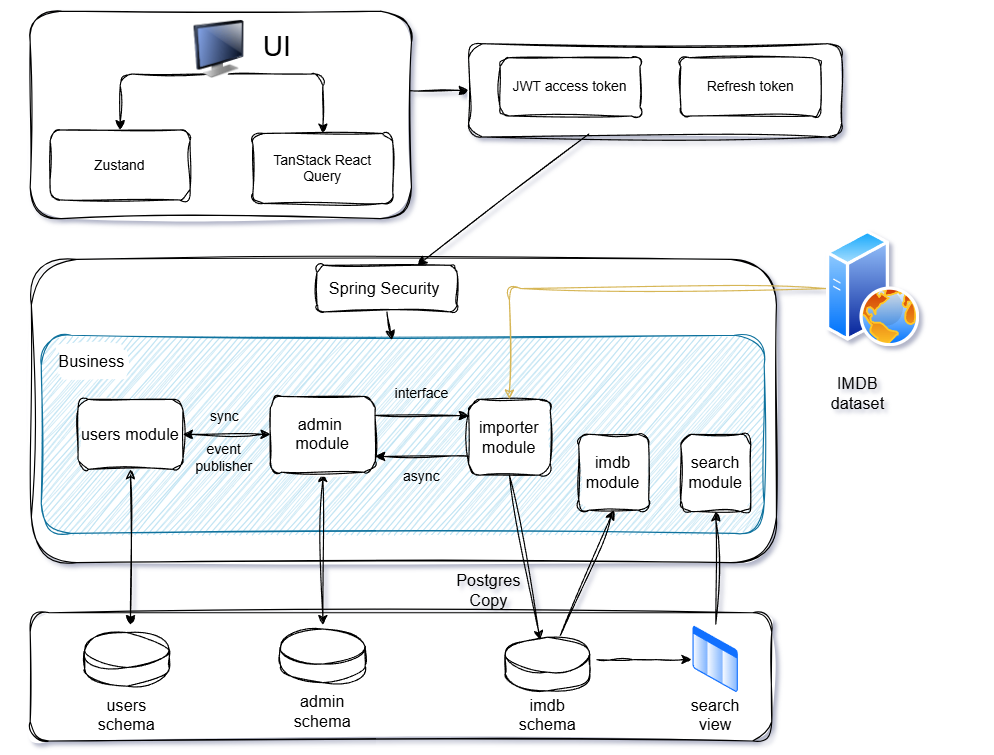
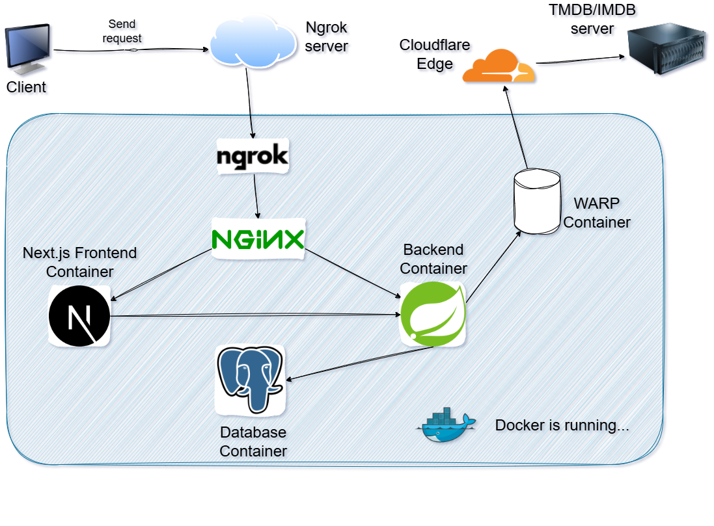
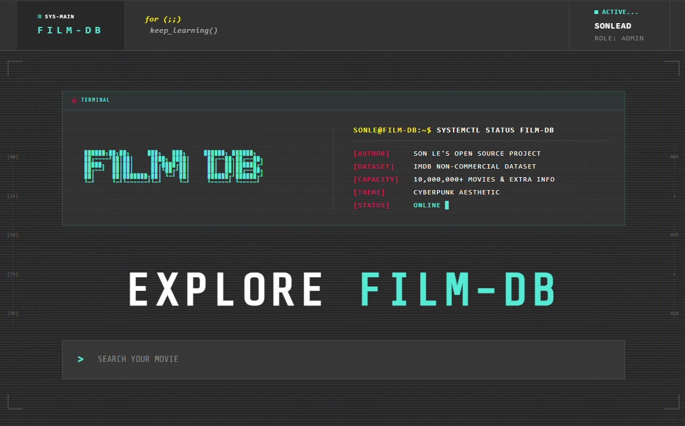
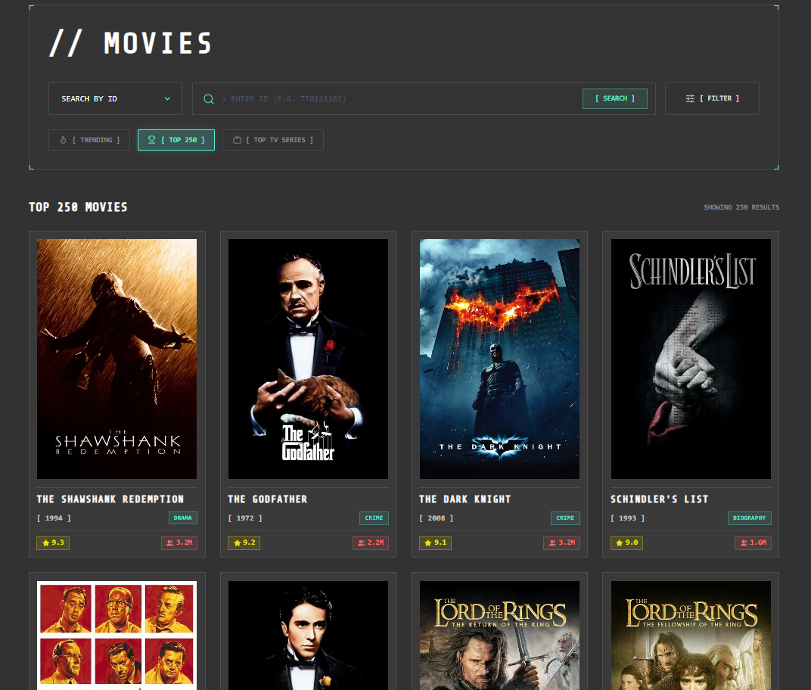
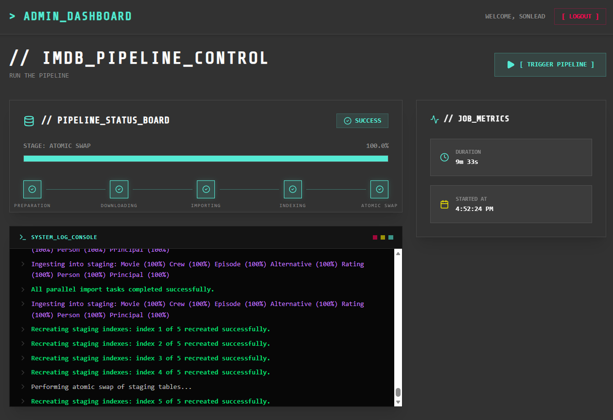

# film-db

This is a web application project (Next.js frontend, Spring Boot backend, and PostgreSQL database) that uses the official IMDb non-commercial dataset with a massive archive of movies and additional information

---

## Core Features

*   **Modular Monolith**: The backend is built using a modular monolith approach. The codebase is split into modules (`users`, `imdb`, `search`, `importer`, `admin`, `shared`) to keep it simple, readable, and easy to maintain, while deploying everything together as a single application.
*   **Basic CRUD & Role-Based Actions**: Film-db supports user registration/login and handles three roles:
    *   **Guest**: No login required, can explore movies, TV shows, cast, crew, and additional info.
    *   **User**: Can create and edit custom lists (favorites, plan to watch, etc.) and add movies to them.
    *   **Admin**: Can trigger the data import pipeline to load the latest IMDb dataset into PostgreSQL.
*   **Custom Search Engine**: Leverages PostgreSQL's native capabilities (Full-Text Search and fuzzy matching) combined with our custom math formulas (matching score + popularity/rating boost) to create a highly accurate, smart search engine on par with IMDb's original search.

---

## Diagrams

### Software Architecture
Here is a high-level view of our Modular Monolith architecture:

*Figure 1: Monorepo Modular Monolith Package Architecture*

### Deployment
Here is the Home server deployment setup (Deploy on my laptop, using arch btw ▲)

*Figure 2: Production Deployment Flow with Nginx, Cloudflare WARP, and Docker*

---

## Documentation & Deep Dives

*   **[Repository Wiki](docs/wiki.md)**: A complete entry point introducing the repository structure, code components, modules, infrastructure, and all documentation files.

I have documented the design decisions and how I approach, solve the problems while building

*   **Solved Challenges & Software Design**:
    *   **Data Pipeline (Download & Import)**: Downloads large datasets in chunked streams, and imports millions of rows to PostgreSQL.
    *   **Module Interaction**: Communication between domain modules using shared interfaces and Spring Events (both synchronous and asynchronous).
    *   **Search Engine**: Combines PostgreSQL Full-Text Search (FTS) and fuzzy matching with custom rating and popularity-based scoring formulas.
    *   **Authentication & Security**: Integrates JWT Access Tokens and Refresh token
    *   **Others**: Zero-downtime database table swaps, Exception Handling, Cloudflare WARP proxy integration, etc..

    *Read the full details in the Software Design documents:*
    *   [Software Design Docs (English)](docs/software-design-docs-en.md)
    *   [Software Design Docs (Vietnamese)](docs/software-design-docs-vn.md)

*   **Tech Stack**: See the full list of frameworks and libraries used across the project in [Tech Stacks](docs/tech-stacks.md).
*   **System Requirements (SRS)**: List of functional requirements in the [SRS Document](docs/SRS.md).

---

## Frontend UI
The UI design is inspired by cyberpunk style, heavily reliant on grids, HUD, and terminal.

The color palette: Cyberpunk Cyan (#55ead4), Cyberpunk Yellow (#f3e600) and Cyberpunk Red (#ff0055)

## Here are some screenshots: 

### Homepage

*Figure 3: HOMEPAGE*

### Movies

*Figure 4: MOVIE page*

### Admin DASHBOARD

*Figure 5: PIPELINE HUD*

---

## Agentic Coding & AI Workflows
This repository is developed in collaboration with **Antigravity**, an agentic AI coding assistant:
*   **AI Custom Workflows**: Leveraging custom slash commands (like `/plan` for design discussions, `/code` for implementation, `/ui` for styling tweaks, and `/analyze` for review).
