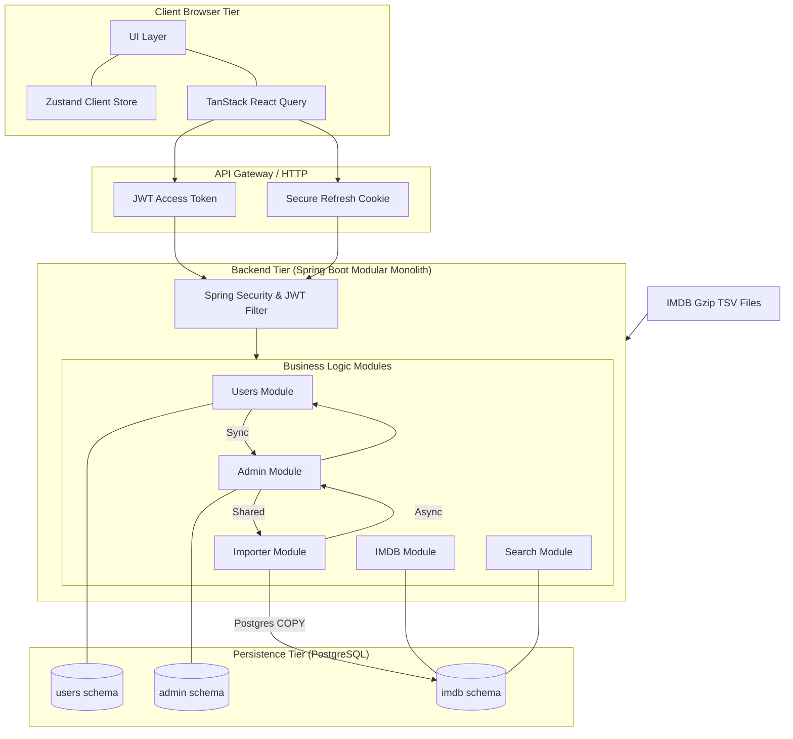

# 🎬 Film-DB: System Architecture

This document describes the technology stacks, tool configurations, and architectural patterns of the Film-DB application, showing how frontend components communicate with the backend modular monolith.

---

## 1. Tech Stacks & Tool Usage

Film-DB is structured as a modern client-server application consisting of a Next.js frontend communicating with a Spring Boot Java backend.

### 1.1 Frontend Stack (Client UI)

*   **Next.js 16.2.6 (App Router)**: Serves as the core React framework. Utilizes server components for optimized initial renders and client components for interactive search, filters, and profile customization pages.
*   **TypeScript**: Ensures type safety across all frontend components, network client wrappers, and state schemas.
*   **Tailwind CSS (v4)**: Used for responsive utility-first layout styling. Provides styling controls and smooth micro-animations following a terminal cyberpunk design system.
*   **Zustand 5**: Manages lightweight client-side global state, such as active session data, token memory, and UI theme states.
*   **TanStack React Query 5**: Manages asynchronous server state caching, pagination fetches, and lists mutation requests. Ensures background data refetching is synchronized seamlessly with UI state changes.
*   **API Fetch Client ([api-client.ts](file:///s:/Coding/Projects/film-db/apps/frontend/film-db-ui/src/lib/api-client.ts) / [api-server.ts](file:///s:/Coding/Projects/film-db/apps/frontend/film-db-ui/src/lib/api-server.ts))**: Custom wrapper over native fetch. Automatically handles cookie management and appends the Bearer token authorization header during browser-side request flows.

### 1.2 Backend Stack (Modular Monolith)

*   **Spring Boot 3.5.13 (Java 21)**: Provides the application container environment. Hosts all modular controllers, security parameters, databases integration layers, and background workers.
*   **Gradle (Kotlin DSL)**: Serves as the build automation tool, executing module compiling, packaging, and dependency resolution.
*   **PostgreSQL**: Serves as the primary database storage engine. Optimizes search lists with customized database index definitions on film metadata (genres, ratings, years).
*   **PostgreSQL JDBC `COPY` API**: Leverages low-overhead bulk writing to insert millions of rows directly into database tables from processed TSV streams.
*   **Spring Security & JWT Filter**: Secures endpoints by inspecting token payloads. Automatically registers stateless sessions using short-lived access tokens and sets cookie parameters for secure HTTP-only session refresh.

---

## 2. System Architecture & Component Interaction

Film-DB follows a **Modular Monolith** backend pattern. Each logical business domain is decoupled into its own independent project module inside the main Spring project.

### 2.1 Database Schema Isolation (PostgreSQL)

To enforce clean decoupling within the database, tables are strictly separated into dedicated PostgreSQL schemas matching backend modules:

1.  **`users` Schema**: Stores credentials, sessions, and curation list parameters.
    *   `user_auth`: Holds username hashes and credentials keys.
    *   `user_profile`: Holds display names, biographies, and creation dates.
    *   `user_list`: Holds custom list configurations (visibility, type, owner).
    *   `user_list_details`: Holds items mapped into specific lists.
    *   `refresh_token`: Holds refresh sessions linked to security.
2.  **`imdb` Schema**: Stores movies, crew, cast, and episode logs from the external dataset.
    *   `movie` & `movie_alternative`: Core metadata and regional localized titles.
    *   `movie_rating`: Average rating scores and vote count metrics.
    *   `movie_crew` & `movie_principal`: Mapping relationships for writers, directors, and actors.
    *   `person`: Personal biographies and details of directors/actors.
    *   `movie_episode`: TV series season mappings and episode numbers.
3.  **`admin` Schema**: Manages logs, background jobs metadata, and role requests.
    *   `pending_request`: Queued approval logs for admin role elevation tasks.
    *   `import_job_history` & `import_job_log`: Status, rows processed, and logging lines for bulk pipeline workers.
    *   `audit_log`: System security logs for administrative operations.

---

### 2.2 Component Communications & Data Flow

#### 1. Decoupled Inter-Module Event System
Backend modules **do not** directly query or modify schemas owned by other modules. Instead, they share a common JVM-level dependency (`shared`) containing event payload definitions, communicating asynchronously or synchronously via Spring's `ApplicationEventPublisher` and `@EventListener` annotations:

*   **Admin Registration Approval**:
    1.  When a user registers for an admin account, the `Users` module publishes a `RegisterAdminEvent`.
    2.  The `Admin` module listens to `RegisterAdminEvent` and inserts a task into `admin.pending_request`.
    3.  An active administrator approves the task, prompting `Admin` to publish an `AdminApprovalEvent`.
    4.  The `Users` module listens to `AdminApprovalEvent`, elevating the user's role to `ROLE_ADMIN` and status to `ACTIVE` in `users.user_auth`.
*   **User Ban / Activation**:
    1.  An administrator bans a user, publishing a `SetUserStateEvent` with state `BANNED`.
    2.  The `Users` module listens to the event and updates the account status in `users.user_auth`.
*   **Import Pipeline Logging**:
    1.  While parsing TSV files, the `Importer` module publishes progress updates via `ImportProgressEvent`.
    2.  The `Admin` module asynchronously (`@Async`) captures the event and records status in `admin.import_job_history` and logging messages in `admin.import_job_log`.

#### 2. Authentication Flow
*   When a user signs in (`/api/auth/login`), the `Users` module validates credentials and returns a short-lived Access Token in the JSON response payload. 
*   Simultaneously, the backend sets an HttpOnly cookie containing the Refresh Token (`refresh_jwt`).
*   The frontend saves the Access Token in Zustand and automatically appends it as a `Bearer` header on subsequent HTTP requests. When the Access Token expires, `TanStack Query` triggers a refresh call to `/api/auth/refresh`, which uses the HTTP-only cookie to obtain a fresh access token without user disruption.

#### 3. Film Discovery & Search Flow
*   Public browse pages make requests using TanStack React Query to `IMDB` and `Search` module endpoints.
*   The `Search` module executes normalized keyword matching queries against PostgreSQL index structures to resolve smart and Vietnamese autocomplete results rapidly.
*   The `IMDB` module handles details retrieval, including TV show season maps and crew lists, feeding results back to responsive frontend views.

#### 4. Administrative Control & Ingestion Pipeline Flow
*   Administrators send role elevation approvals or request data updates from the frontend Admin Portal.
*   Requests pass through Spring Security's authorization filters to check for `ROLE_ADMIN` and `ACTIVE` state.
*   Approved ingestion commands prompt the `Importer` module to execute asynchronous bulk loads: downloading Gzip TSV dataset files, streaming rows in chunk increments, and using high-speed JDBC `COPY` interfaces to wipe and reload database targets without locking search resources.

