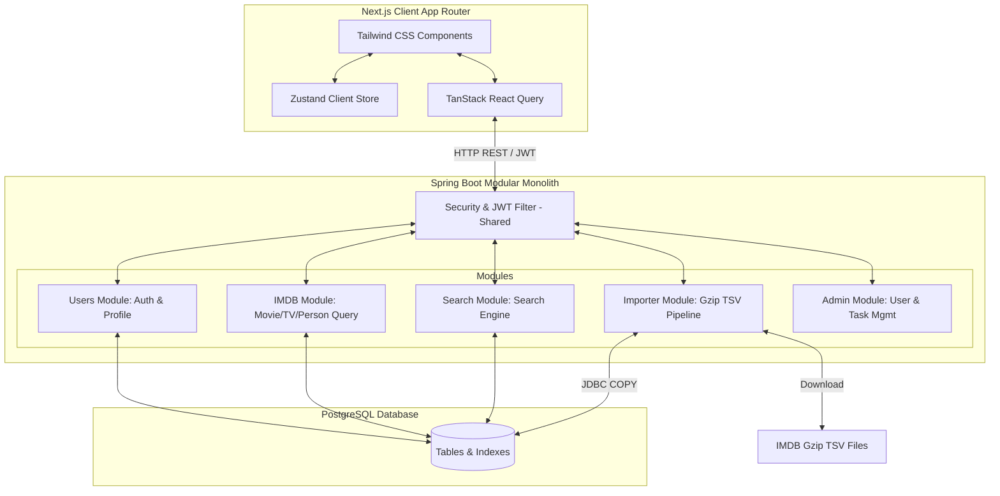
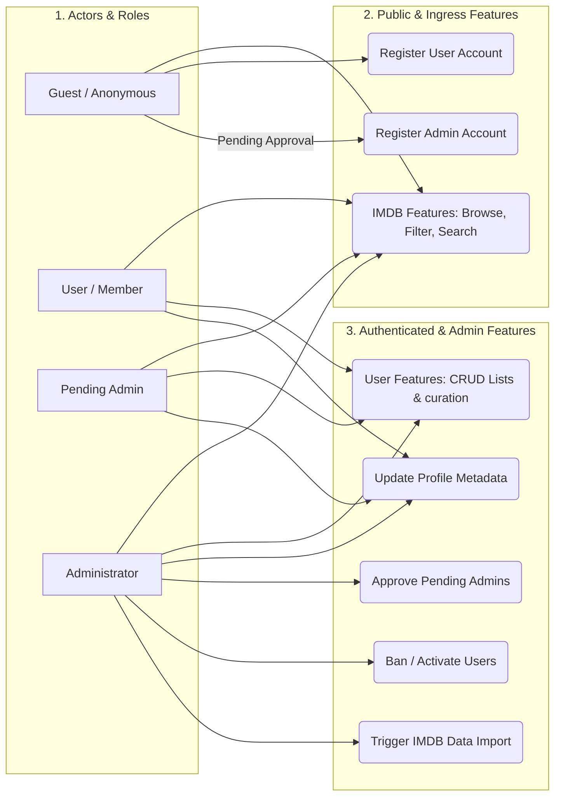

# 🎬 Film-DB: Software Requirements Specification (SRS)

A modern, high-performance web interface for exploring IMDB movie datasets, curating personal lists, and managing import operations.

---

## 1. Introduction

### 1.1 Purpose
This document specifies the software requirements for the **Film-DB Frontend** application. It serves as the single source of truth for developers, designers, and testers to understand how the web interface interacts with the Film-DB modular monolith backend to deliver a seamless movie discovery and curation experience.

### 1.2 Scope
The Film-DB client is a responsive web application that provides:
* **Public Discovery**: Rich filtering and searching of movies, TV shows, and crew members sourced from the IMDB dataset.
* **Curation Engine**: Secure user authentication, profile customization, and custom list management (watchlist, favorites, custom-themed collections).
* **Administrative Console**: Tools for administrators to oversee users, review administrative access requests, and trigger data ingestion pipelines.

---

## 2. Overall Description

### 2.1 System Architecture
The application follows a client-server architecture. The frontend communicates with the Spring Boot backend via RESTful APIs, securing transactions using JWT access and refresh tokens.



### 2.2 Technology Stack
* **Client Frontend**:
  * **Framework**: Next.js 16.2.6 (App Router, React 19)
  * **Styling**: Tailwind CSS (v4) for responsive utility-first layouts
  * **State & Data Management**: Zustand 5 (Client State) & TanStack React Query 5 (Server State)
  * **API Fetching**: Native fetch wrapper configured with base endpoints (`api-client.ts` and `api-server.ts`)
* **Backend Monolith**:
  * Spring Boot 3.5.13 (Java 21), Gradle (Kotlin DSL), PostgreSQL
  * JWT Auth & Session Cookie Management

### 2.3 Modular Structure
The backend modular monolith structure maps to specific domains:
* `admin`: Handles admin roles, user info/lists inspection, and approval logs.
* `imdb`: Manages core movie, TV series, seasons, and actor/crew details.
* `importer`: Triggers downloading and ingesting IMDB TSV files using PostgreSQL's high-speed JDBC `COPY`.
* `search`: Standard query search index.
* `shared`: Houses cross-cutting exceptions, utility schemas, and Spring Security filters.
* `users`: Holds registration, profile customization, and custom list metadata/details.

---

## 3. System Features & Functional Requirements

> [!NOTE]
> All functional requirements utilize the prefix `FR-<domain>-<id>` for clean traceability. Every request matches real Spring Boot Controller mappings.

### 3.1 Authentication & Profile (AUTH)

#### `FR-AUTH-01: User Registration`
* **Description**: Allows new visitors to create a standard user account.
* **Input**: 
  * Path: `POST /api/auth/register`
  * Body:
    ```json
    {
      "username": "jane_doe",
      "password": "SuperSecurePassword123!"
    }
    ```
* **Output**: `200 OK`
  * Body:
    ```json
    {
      "token": "eyJhbGciOiJIUzI1NiIsIn..."
    }
    ```
* **Note**: A companion HttpOnly cookie containing the refresh token is set by the backend.

#### `FR-AUTH-02: Admin Registration Request`
* **Description**: Allows administrative users to request account creation. These accounts start in a pending state until approved.
* **Input**:
  * Path: `POST /api/auth/register/admin`
  * Body:
    ```json
    {
      "username": "admin_bob",
      "password": "AdminSecurePassword987!"
    }
    ```
* **Output**: `200 OK`
  * Body:
    ```json
    {
      "token": "eyJhbGciOiJIUzI1NiIsIn..."
    }
    ```
* **Note**: The user will have role `ROLE_ADMIN` but user state `PENDING_APPROVAL`. They cannot access administrative endpoints until approved.

#### `FR-AUTH-03: User Login`
* **Description**: Authenticates users using their username and password.
* **Input**:
  * Path: `POST /api/auth/login`
  * Body:
    ```json
    {
      "username": "jane_doe",
      "password": "SuperSecurePassword123!"
    }
    ```
* **Output**: `200 OK`
  * Body:
    ```json
    {
      "token": "eyJhbGciOiJIUzI1NiIsIn..."
    }
    ```

#### `FR-AUTH-04: Token Refresh`
* **Description**: Refreshes the short-lived access token using the HTTP-only refresh token cookie.
* **Input**:
  * Path: `POST /api/auth/refresh`
  * Cookie: `refresh_jwt=eyJhbGciOi...`
* **Output**: `200 OK`
  * Body:
    ```json
    {
      "token": "eyJhbGciOiJIUzI1NiIsIn..."
    }
    ```

#### `FR-AUTH-05: User Logout`
* **Description**: Invalidates the user session and clears the HttpOnly refresh token cookie.
* **Input**:
  * Path: `POST /api/auth/logout`
* **Output**: `200 OK`
  * Body: Empty

#### `FR-AUTH-06: Profile Details Lookup`
* **Description**: Retrieves public profile information for a specific username.
* **Input**:
  * Path: `GET /api/v1/user/profile`
  * Query Parameter: `username=jane_doe`
* **Output**: `200 OK`
  * Body:
    ```json
    {
      "userId": "d3b07384-d113-4ecb-a320-fd0e19488349",
      "displayName": "Jane Doe",
      "username": "jane_doe",
      "dateCreated": "2026-05-23T14:23:00Z",
      "bio": "Movie enthusiast & cataloger",
      "role": "ROLE_USER",
      "userState": "ACTIVE"
    }
    ```

#### `FR-AUTH-07: Update Profile Metadata`
* **Description**: Allows logged-in users to update their profile bio and display name.
* **Input**:
  * Path: `PATCH /api/v1/user/profile`
  * Headers: `Authorization: Bearer <token>`
  * Body:
    ```json
    {
      "displayName": "Jane D. Doe",
      "bio": "Avid watcher. Rating everything."
    }
    ```
* **Output**: `200 OK` (String representation)
  * Body: `"Update profile user profile success"`

#### `FR-AUTH-08: Change Username`
* **Description**: Allows a user to change their account username, requiring verification of credentials.
* **Input**:
  * Path: `PUT /api/v1/user/profile/username`
  * Headers: `Authorization: Bearer <token>`
  * Body:
    ```json
    {
      "username": "jane_doe",
      "password": "SuperSecurePassword123!",
      "newUsername": "jane_doe_prime"
    }
    ```
* **Output**: `200 OK`
  * Body: `"Change username success!"`

#### `FR-AUTH-09: Request Admin Role`
* **Description**: Allows an existing standard user to request promotion to the Admin role.
* **Input**:
  * Path: `POST /api/v1/user/profile/request-admin`
  * Headers: `Authorization: Bearer <token>`
* **Output**: `200 OK`
  * Body: `"Request admin role success"`
* **Note**: Creates a pending request in the admin queue, to be approved by an existing admin.

---

### 3.2 IMDB Search & Discovery (DISC)

#### `FR-DISC-01: Advanced Movie Filtering`
* **Description**: Retrieves a paginated list of movies based on genre, minimum rating, and minimum votes.
* **Input**:
  * Path: `PATCH /api/v1/imdb/listfilm/filter`
  * Query Parameters: `page=0`, `size=10` (optional)
  * Body:
    ```json
    {
      "startYear": 2010,
      "averageRating": 8.0,
      "numVotes": 10000,
      "titleType": "movie",
      "genre": "Action"
    }
    ```
* **Output**: `200 OK`
  * Body: Paginated payload (`PageMovieRatingInfoDto`)
    ```json
    {
      "totalPages": 45,
      "totalElements": 448,
      "size": 10,
      "number": 0,
      "content": [
        {
          "movieId": "tt1375666",
          "primaryTitle": "Inception",
          "originalTitle": "Inception",
          "isAdult": false,
          "startYear": 2010,
          "runtimeMinutes": 148,
          "genres": ["Action", "Adventure", "Sci-Fi"],
          "averageRating": 8.8,
          "numVotes": 2400000
        }
      ],
      "first": true,
      "last": false,
      "empty": false
    }
    ```

#### `FR-DISC-02: Movie Filtering and Sorting`
* **Description**: Filters titles similar to `FR-DISC-01` but supports specific sorting dimensions (e.g. ratings, release year).
* **Input**:
  * Path: `PATCH /api/v1/imdb/listfilm/filter/sort`
  * Query Parameters: `page=0`, `size=10`
  * Body:
    ```json
    {
      "startYear": 1999,
      "averageRating": 7.5,
      "numVotes": 5000,
      "titleType": "movie",
      "sortBy": "averageRating",
      "sortDirection": "DESC",
      "genre": "Drama"
    }
    ```
* **Output**: `200 OK` (`PageMovieRatingInfoDto` content)

#### `FR-DISC-03: Movie Detail Lookup`
* **Description**: Returns all basic and metadata info for a specific film by its IMDB ID.
* **Input**:
  * Path: `GET /api/v1/imdb/film/{film-id}` (e.g. `/api/v1/imdb/film/tt1375666`)
* **Output**: `200 OK`
  * Body:
    ```json
    {
      "movieId": "tt1375666",
      "primaryTitle": "Inception",
      "originalTitle": "Inception",
      "isAdult": false,
      "startYear": 2010,
      "runtimeMinutes": 148,
      "genres": ["Action", "Adventure", "Sci-Fi"]
    }
    ```

#### `FR-DISC-04: Full Movie Rating & Metadata`
* **Description**: Returns complete details including average rating and vote count.
* **Input**:
  * Path: `GET /api/v1/imdb/film/full/{film-id}`
* **Output**: `200 OK`
  * Body:
    ```json
    {
      "movieId": "tt1375666",
      "primaryTitle": "Inception",
      "originalTitle": "Inception",
      "isAdult": false,
      "startYear": 2010,
      "runtimeMinutes": 148,
      "genres": ["Action", "Adventure", "Sci-Fi"],
      "averageRating": 8.8,
      "numVotes": 2415000
    }
    ```

#### `FR-DISC-05: Alternative Regional Titles`
* **Description**: Fetches alternate titles and translated names for international regions.
* **Input**:
  * Path: `GET /api/v1/imdb/film/alternative/{film-id}`
* **Output**: `200 OK`
  * Body:
    ```json
    {
      "movieId": "tt1375666",
      "localizedTitles": [
        {
          "title": "Inception: El origen",
          "region": "MX",
          "language": "es"
        }
      ]
    }
    ```

#### `FR-DISC-06: Person Profile & Details`
* **Description**: Returns the professional profile and the known titles for a director, writer, or actor.
* **Input**:
  * Path: `GET /api/v1/imdb/person/{person-id}/details` (e.g. `/api/v1/imdb/person/nm0000204/details`)
* **Output**: `200 OK`
  * Body:
    ```json
    {
      "personId": "nm0000204",
      "primaryName": "Christopher Nolan",
      "primaryProfession": ["director", "writer", "producer"],
      "knownForTitles": [
        {
          "movieId": "tt1375666",
          "primaryTitle": "Inception",
          "originalTitle": "Inception",
          "isAdult": false,
          "startYear": 2010,
          "runtimeMinutes": 148,
          "genres": ["Action", "Sci-Fi"]
        }
      ]
    }
    ```

#### `FR-DISC-07: TV Series Seasons & Episodes`
* **Description**: Lists all seasons and episodes for a TV Series.
* **Input**:
  * Path: `GET /api/v1/imdb/tvseries/{film-id}/episodes`
* **Output**: `200 OK`
  * Body: Array of `EpisodeInfoDto`
    ```json
    [
      {
        "episodeId": "tt1234567",
        "parentMovieId": "tt0944947",
        "seasonNumber": 1,
        "episodeNumber": 1,
        "primaryTitle": "Winter Is Coming",
        "originalTitle": "Winter Is Coming",
        "startYear": 2011,
        "runtimeMinutes": 62
      }
    ]
    ```

---

### 3.3 User Lists & Curation (LIST)

#### `FR-LIST-01: Create Custom List`
* **Description**: Users can create themed movie collections with metadata.
* **Input**:
  * Path: `POST /api/v1/users/lists`
  * Headers: `Authorization: Bearer <token>`
  * Body:
    ```json
    {
      "nameList": "My Sci-Fi Classics",
      "type": "MIXTURE",
      "isPublic": true
    }
    ```
* **Output**: `200 OK` (returns the string confirmation or list UUID)
  * Body: `"Create User list success!"`

#### `FR-LIST-02: Update List Metadata`
* **Description**: Updates list parameters including visibility, custom flag, or type.
* **Input**:
  * Path: `PATCH /api/v1/users/lists`
  * Headers: `Authorization: Bearer <token>`
  * Body:
    ```json
    {
      "userId": "d3b07384-d113-4ecb-a320-fd0e19488349",
      "listId": "ac820078-43d9-40fe-8f0a-1563f6ba012b",
      "nameList": "Must Watch Sci-Fi",
      "isPublic": false,
      "isCustom": true,
      "listType": "PLAN_TO_WATCH"
    }
    ```
* **Output**: `200 OK`
  * Body: `"Update metadata user list success!"`

#### `FR-LIST-03: View All Personal Lists`
* **Description**: Returns all watchlists, favorites, and custom lists owned by the user.
* **Input**:
  * Path: `GET /api/v1/users/lists/all`
  * Headers: `Authorization: Bearer <token>`
* **Output**: `200 OK`
  * Body: Array of `UserListDto`
    ```json
    [
      {
        "listId": "ac820078-43d9-40fe-8f0a-1563f6ba012b",
        "userId": "d3b07384-d113-4ecb-a320-fd0e19488349",
        "nameList": "Must Watch Sci-Fi",
        "listType": "PLAN_TO_WATCH",
        "isCustom": true,
        "isPublic": false,
        "dateCreated": "2026-05-23T20:00:00Z"
      }
    ]
    ```

#### `FR-LIST-04: Add Item to List`
* **Description**: Appends a movie or show to a user list with watch status and review notes.
* **Input**:
  * Path: `POST /api/v1/users/lists/{list-id}/item`
  * Headers: `Authorization: Bearer <token>`
  * Body:
    ```json
    {
      "movieId": "tt1375666",
      "state": "PLAN_TO_WATCH",
      "notes": "Need to rewatch this in IMAX if possible."
    }
    ```
* **Output**: `200 OK`
  * Body: `"Add list item details success!"`

#### `FR-LIST-05: Update List Item Details`
* **Description**: Updates the watch status or note for a movie already inside a list.
* **Input**:
  * Path: `PATCH /api/v1/users/lists/{list-id}/item`
  * Headers: `Authorization: Bearer <token>`
  * Body:
    ```json
    {
      "itemId": "f47ac10b-58cc-4372-a567-0e02b2c3d479",
      "state": "WATCHED",
      "notes": "Loved the Hans Zimmer score!"
    }
    ```
* **Output**: `200 OK`
  * Body: `"Update details metadata list item details success!"`

#### `FR-LIST-06: Remove Item from List`
* **Description**: Deletes a list item reference.
* **Input**:
  * Path: `DELETE /api/v1/users/lists/{list-id}/item/{item-id}`
  * Headers: `Authorization: Bearer <token>`
* **Output**: `200 OK`
  * Body: `"Delete list item details success"`

---

### 3.4 Administrative Console (ADM)

#### `FR-ADM-01: View Pending Admin Requests`
* **Description**: Lists users who have requested admin roles or signed up through `/api/auth/register/admin`.
* **Input**:
  * Path: `GET /api/admin/job/pending-tasks`
  * Headers: `Authorization: Bearer <admin_token>`
* **Output**: `200 OK`
  * Body: Array of `PendingRequestDto`
    ```json
    [
      {
        "userId": "e67503fc-4623-45f8-b3d9-d04b9015c719",
        "username": "admin_bob",
        "dateCreated": "2026-05-23T21:10:00Z"
      }
    ]
    ```

#### `FR-ADM-02: Approve Admin Request`
* **Description**: Promotes a user to administrative state.
* **Input**:
  * Path: `POST /api/admin/job/approve-admin`
  * Query Parameter: `userId=e67503fc-4623-45f8-b3d9-d04b9015c719`
  * Headers: `Authorization: Bearer <admin_token>`
* **Output**: `200 OK`
  * Body: `"Approve admin for user success"`

#### `FR-ADM-03: Ban User`
* **Description**: Deactivates a user's account, preventing login and token refreshes.
* **Input**:
  * Path: `PUT /api/admin/users/{user-id}/state/ban`
  * Headers: `Authorization: Bearer <admin_token>`
* **Output**: `200 OK`
  * Body: `"Ban user success!"`

#### `FR-ADM-04: Trigger Data Import Pipeline`
* **Description**: Initiates backend workers to download, extract, and bulk-load IMDB TSV files into PostgreSQL database.
* **Input**:
  * Path: `GET /api/admin/import-pipeline`
  * Headers: `Authorization: Bearer <admin_token>`
* **Output**: `200 OK`
  * Body: `"Triggered pipeline job successfully"`
* **Note**: Importer clears existing tables, streams dataset files, and executes high-speed PostgreSQL `COPY` queries.

---

## 4. User & Use Cases

### 4.1 User Personas
* **Guest (Anonymous)**: Browses public search listings, filters by year, looks up director detail sheets. No login required.
* **Member (Authenticated)**: Can search and curate custom movie watchlists, rate entries, and customize profile display tags.
* **Pending Admin**: A user requesting admin clearance. Restricted from executing admin control logs until approved.
* **Administrator**: Full privileges to approve other admins, ban malicious users, audit database logs, and trigger high-resource data ingestion pipelines.

### 4.2 Use Case Diagram



---

## 5. Non-functional Requirements (NFR)

### 5.1 Performance & Latency
* **NFR-PERF-01**: IMDB movie list filtering must return sub-second response times (less than **500ms** latency under 100 concurrent requests). This is supported by composite PostgreSQL indexing on `averageRating`, `startYear`, and `genres`.
* **NFR-PERF-02**: Long scrollable pages (like lists of all movies or admin audit users lists) must implement virtual scrolling or infinite pagination to minimize DOM node overhead in the client browser.

### 5.2 Security & Data Privacy
* **NFR-SEC-01**: User access tokens (JWT) must have a lifespan of **15 minutes**. Refresh tokens are stored inside secure `HttpOnly`, `SameSite=Strict` cookies to mitigate Cross-Site Scripting (XSS) and Cross-Site Request Forgery (CSRF) vectors.
* **NFR-SEC-02**: All communication between client and monolith must traverse encrypted transport layers (TLS 1.3).
* **NFR-SEC-03**: All administrative routes (`/api/admin/**`) are strictly guarded behind role authorization checks on the Spring Boot monolith filter chain.

### 5.3 UX, Styling, and Accessibility
* **NFR-UX-01**: The client interface must utilize Tailwind CSS (v4) with a modern visual design, showcasing smooth transitions, glassmorphism accents, hover states, and clear loading indicators.
* **NFR-UX-02**: The interface must comply with WCAG AA accessibility standards, assuring a contrast ratio of at least 4.5:1 for body copy and complete keyboard navigation support.
* **NFR-UX-03**: Responsive layout support is mandatory, optimizing components across mobile, tablet, and widescreen desktop displays.

### 5.4 Operational & Scaling
* **NFR-OPS-01**: Database bulk loading during TSV imports should operate asynchronously without blocking standard user query search traffic.
* **NFR-OPS-02**: The importer must handle large datasets efficiently using streaming IO and PostgreSQL JDBC `COPY` queries to avoid loading entire TSV contents into JVM memory.
